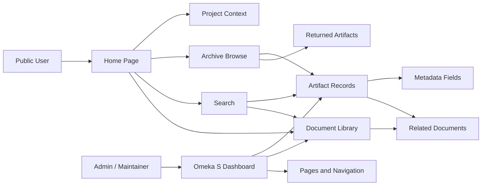

# Archive Structure Diagram

This diagram shows a generalized Omeka S archive structure for a public-facing digital humanities project.

## What This Represents

- Public users entering through home, context, search, browse, or document paths.
- Archive records connected to metadata and related documents.
- Maintainers managing records, documents, pages, and navigation in Omeka S.
- A structure that supports public browsing and future content expansion.

## Public Sharing Note

This is a generalized architecture diagram. It does not include a private sitemap, production admin URLs, raw data, or client-specific internal details.
